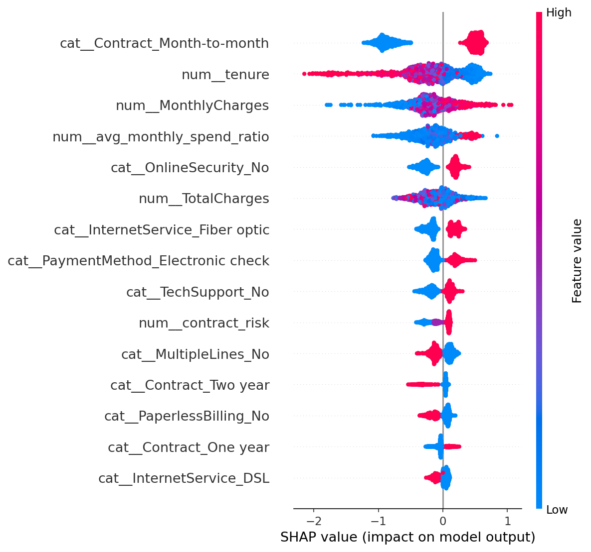
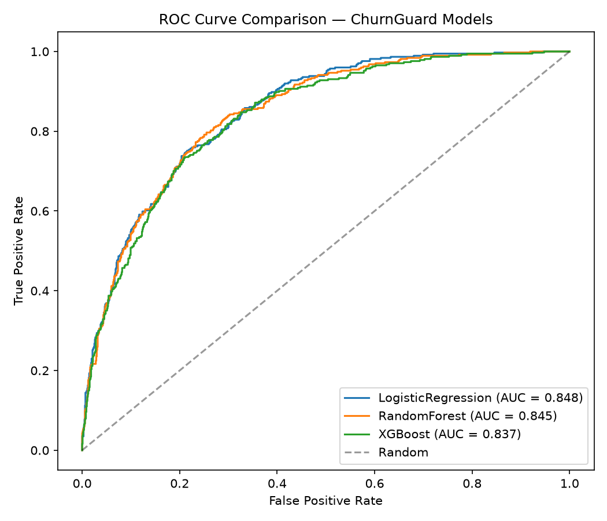

# ChurnGuard : End-to-End Customer Churn Prediction System

A complete, deployed data science project: from raw data to a served, monitored
prediction API. Built to demonstrate the full DS/ML lifecycle — not just a
notebook with a model in it.

**Problem statement:** predict which customers are likely to churn (cancel
their subscription) so a retention team can intervene before it happens.
Churn prediction is one of the most common real-world DS problems (subscription
businesses, telecoms, SaaS) and one of the most common DS interview case studies.

---

## What this project actually contains

| Layer | What it demonstrates |
|---|---|
| **EDA notebook** (`notebooks/01_eda.ipynb`) | Real exploratory analysis, findings tied directly to feature engineering decisions |
| **Feature engineering** (`app/features.py`) | Domain-informed features, packaged as a reusable `sklearn` `ColumnTransformer` (no train/serve skew) |
| **Model comparison** (`train.py`) | Logistic Regression → Random Forest → XGBoost, with class-imbalance handling and honest evaluation |
| **Explainability** (SHAP) | Global feature importance + per-prediction explanations served live by the API |
| **Business translation** | Model output converted into a dollar figure — revenue-at-risk correctly flagged |
| **Deployment** (`app/main.py`, `Dockerfile`) | A real FastAPI service serving the trained model, containerized |
| **Monitoring** (`dashboard/app.py`) | A Streamlit dashboard tracking live prediction volume and score drift, reading from a logged-prediction table |
| **Tests** (`tests/`) | Unit tests on data cleaning/feature logic + API integration tests |

---

## Dataset

**IBM Telco Customer Churn** — 7,043 customers, 21 columns (demographics,
account details, subscribed services, churn label). Publicly available,
no scraping or weak-label construction required — this let the actual project
time go into modeling and deployment rather than data collection.

Overall churn rate: **26.5%** — imbalanced enough that plain accuracy is
misleading (a model that always predicts "no churn" scores 73.5% accuracy
while catching zero at-risk customers), which is why this project evaluates
on precision/recall/ROC-AUC and explicitly handles class imbalance rather
than reporting accuracy as the headline number.

---

## Key EDA findings → feature engineering decisions

| Finding | Engineered feature |
|---|---|
| Month-to-month contracts churn ~3-4x more than 1-2 year contracts | `contract_risk` — ordinal risk encoding |
| Churn risk is heavily front-loaded in the first ~12 months | `tenure_bucket` — coarse tenure groups |
| More subscribed add-on services → stickier customer | `num_services` — count of active services |
| Fiber-optic / high-monthly-bill customers churn more | `avg_monthly_spend_ratio` — current bill vs. historical average, flags recent price increases |

Full analysis with charts is in `notebooks/01_eda.ipynb`.

---

## Model comparison (real results on held-out test set, 20% split, stratified)

| Model | Precision (Churn) | Recall (Churn) | F1 | ROC-AUC | Fit time |
|---|---|---|---|---|---|
| Logistic Regression (baseline) | 0.50 | **0.80** | 0.62 | **0.848** | 0.06s |
| Random Forest | 0.54 | 0.77 | **0.64** | 0.845 | 1.36s |
| **XGBoost (shipped)** | 0.54 | 0.76 | 0.63 | 0.838 | 0.37s |

**Why XGBoost was shipped despite not having the single best ROC-AUC:**
all three models land within ~1 point of ROC-AUC of each other, which means
this decision comes down to production concerns, not raw accuracy:
- Native SHAP `TreeExplainer` support gives fast, exact per-prediction
  explanations — required for the "top factors" field the API returns on
  every request.
- Handles the categorical/numeric feature mix natively without the
  sensitivity to feature scaling that hurts Logistic Regression's
  interpretability at inference time.
- Sub-second training time makes periodic retraining on fresh data trivial,
  compared to Random Forest's higher fit cost at scale.

In an interview, this is the honest answer to "why not just use the model
with the highest number": the highest metric alone doesn't decide a
production model choice — interpretability, inference cost, and retraining
cost do too.

**Class imbalance handling:** class weighting (`class_weight="balanced"` /
`scale_pos_weight`) rather than SMOTE. Rationale documented in `train.py` —
weighting avoids synthesizing artificial customer records, which matters
here since some features (e.g. `avg_monthly_spend_ratio`) are engineered
ratios that don't interpolate meaningfully between real customers the way
SMOTE assumes.

---

## Top churn drivers (SHAP)



Top 5 by mean |SHAP| impact:
1. `Contract = Month-to-month` — by far the strongest driver
2. `tenure` — short tenure sharply increases risk
3. `MonthlyCharges` — higher bills increase risk
4. `avg_monthly_spend_ratio` — recent bill increases relative to history
5. `OnlineSecurity = No` — customers without this add-on churn more

## Model comparison — ROC curves



---

## Business impact translation

On the held-out test set (1,409 customers, 374 actual churners):

> At the default 0.5 decision threshold, the shipped model **correctly
> flagged 283 of 374 actual churners (75.7% recall)**. At an average
> monthly charge of $64.09 across these customers, that represents
> **~$217,600 in annualized revenue-at-risk correctly identified** for a
> retention team to act on — before any threshold tuning to trade off
> precision vs. recall based on the retention team's actual outreach capacity.

This is the sentence that goes on a resume, and it's the number an
interviewer will ask you to defend — which is why it's computed directly
from the test-set predictions in `train.py`, not estimated by hand.

---

## Architecture

```
churnguard/
├── data/
│   └── telco_churn.csv          # raw dataset
├── notebooks/
│   └── 01_eda.ipynb             # exploratory analysis (executed, with charts)
├── app/
│   ├── data_prep.py             # loading + cleaning (shared by train + serve)
│   ├── features.py              # feature engineering (shared by train + serve)
│   ├── predictor.py             # model loading + SHAP explanation service
│   ├── db.py                    # prediction logging (SQLite by default, Postgres-ready)
│   ├── main.py                  # FastAPI app
│   └── schemas/
│       └── customer.py          # Pydantic request/response models
├── models/
│   ├── churn_model.joblib       # trained pipeline (preprocessor + XGBoost)
│   ├── metrics.json             # full evaluation results, all 3 models
│   ├── shap_summary.png
│   └── model_comparison.png
├── dashboard/
│   └── app.py                   # Streamlit monitoring dashboard
├── tests/
│   └── test_pipeline.py
├── train.py                     # end-to-end training script
├── requirements.txt
├── Dockerfile                   # API container
├── Dockerfile.dashboard         # dashboard container
└── docker-compose.yml           # API + Postgres + dashboard, one command
```

The same `data_prep.py` and `features.py` modules are imported by both
`train.py` and `app/predictor.py` — this is deliberate: it guarantees the
exact transformation used to train the model is the transformation used to
serve it, eliminating train/serve skew, a real production ML failure mode
worth naming explicitly in an interview.

---

## Running it

### Option A — Docker Compose (recommended, closest to production)

```bash
docker compose up --build
```

- API: `http://localhost:8000` (docs at `/docs`)
- Dashboard: `http://localhost:8501`
- Postgres for prediction logging (swap-in replacement for the default SQLite)

### Option B — Local

```bash
pip install -r requirements.txt

# 1. Train the model (writes models/churn_model.joblib + metrics + plots)
python train.py

# 2. Serve the API
uvicorn app.main:app --reload

# 3. In a second terminal, run the dashboard
streamlit run dashboard/app.py
```

### Example request

```bash
curl -X POST http://localhost:8000/predict-churn \
  -H "Content-Type: application/json" \
  -d '{
    "gender": "Female", "SeniorCitizen": 0, "Partner": "Yes", "Dependents": "No",
    "tenure": 2, "PhoneService": "Yes", "MultipleLines": "No",
    "InternetService": "Fiber optic", "OnlineSecurity": "No", "OnlineBackup": "No",
    "DeviceProtection": "No", "TechSupport": "No", "StreamingTV": "No", "StreamingMovies": "No",
    "Contract": "Month-to-month", "PaperlessBilling": "Yes", "PaymentMethod": "Electronic check",
    "MonthlyCharges": 70.7, "TotalCharges": 151.65
  }'
```

Response:
```json
{
  "churn_probability": 0.7801,
  "risk_tier": "high",
  "top_factors": [
    {"feature": "cat__Contract_Month-to-month", "impact": 0.5922, "direction": "increases_risk"},
    {"feature": "num__tenure", "impact": 0.3869, "direction": "increases_risk"},
    {"feature": "num__MonthlyCharges", "impact": -0.2009, "direction": "decreases_risk"},
    {"feature": "cat__OnlineSecurity_No", "impact": 0.1896, "direction": "increases_risk"},
    {"feature": "cat__MultipleLines_No", "impact": -0.1708, "direction": "decreases_risk"}
  ],
  "model_version": "xgboost-v1"
}
```

### Running tests

```bash
pytest tests/ -v
```

---

## API reference

| Endpoint | Method | Description |
|---|---|---|
| `/health` | GET | Liveness check |
| `/predict-churn` | POST | Predict churn risk for one customer, returns probability + risk tier + top 5 SHAP factors |
| `/metrics` | GET | Training-time model comparison metrics (all 3 models) |
| `/predictions/recent` | GET | Recently logged predictions, used by the monitoring dashboard |

Full interactive docs (Swagger UI) at `/docs` once the API is running.

---

## What's deliberately *not* in scope (and why, if asked)

- **Real-time streaming retraining** — out of scope for a portfolio project;
  documented as a natural extension (e.g. scheduled retraining job + model
  registry) rather than built, since a one-off training script is the right
  scope for this dataset's size and update frequency.
- **A/B testing the model in production** — no live production traffic to
  test against; the monitoring dashboard's drift tracking is the honest
  substitute — it shows how you'd *detect* the need for retraining, which is
  the actually-testable claim here.
- **SMOTE** — considered and explicitly rejected in favor of class weighting;
  see `train.py` docstring for the reasoning, since "why not SMOTE" is a
  common follow-up question.

---

## Resume line this project supports

> Built and deployed an end-to-end customer churn prediction system
> (XGBoost, FastAPI, Docker, PostgreSQL) achieving 75.7% recall on at-risk
> customers with SHAP-based per-prediction explainability; designed a
> monitoring dashboard to track prediction-score drift in production.

## Tech stack

Python · pandas · scikit-learn · XGBoost · SHAP · FastAPI · Pydantic ·
SQLAlchemy · PostgreSQL · Docker · Docker Compose · Streamlit · Plotly · pytest
